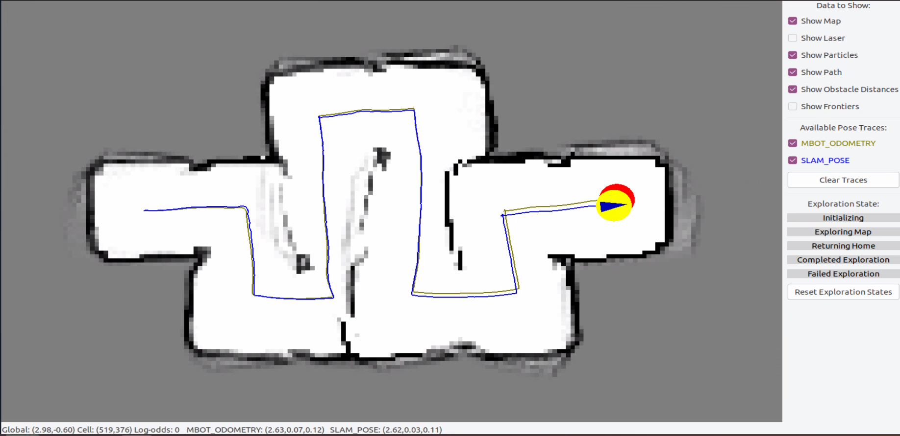

# Botlab: Autonomous Mobile Robot

In this lab, we worked on a differential-drive mobile robot equipped with a 2D LiDAR and custom-built forklift mechanism to achieve autonomous block transport and navigation. We developed and integrated the full autonomy pipeline, including low-level motor control, state estimation through SLAM, global path planning, and real-world actuation.

By the end of this lab, we learned how to:

- **Control:**
  - Calibrate and tune motor PWM using PID controllers
  - Design velocity and pose controllers for robust closed-loop control
  - Fuse odometry and IMU data for improved localization

- **Perception:**
  - Implement SLAM using particle filters, action and sensor models
  - Build and update occupancy grid maps
  - Localize from unknown poses using probabilistic models

  

- **Planning & Autonomy:**
  - Generate global paths using the A* algorithm
  - Explore unknown environments with frontier-based exploration
  - Perform block pickup and transport using AprilTag-based visual servoing and a custom forklift attachment

- **Hardware Integration:**
  - Construct and control a lifting mechanism for block manipulation
  - Interface Jetson Nano with robot firmware for real-time sensing and control